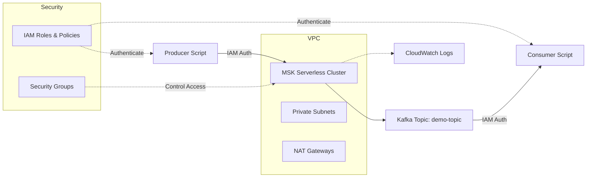

# AWS MSK Kafka Starter

[](https://github.com/saranreddy/aws-msk-kafka-starter/actions/workflows/ci.yml)
[](https://opensource.org/licenses/MIT)
[](https://www.terraform.io/)

A production-ready starter for AWS MSK (Managed Streaming for Apache Kafka) with Terraform infrastructure, Python producer/consumer scripts, and complete documentation. Deploy a fully functional Kafka cluster with IAM authentication in minutes.

## 🏗️ Architecture



**Key Components:**
- **MSK Serverless Cluster**: Fully managed Kafka with automatic scaling and no broker management
- **VPC with Private/Public Subnets**: Dedicated network with NAT gateways for secure internet access
- **IAM Authentication**: Secure access using AWS IAM roles and policies
- **Python Scripts**: Simple producer and consumer CLIs for testing and demonstration
- **CloudWatch Integration**: Logs and monitoring for cluster health

## ✨ Features

- ✅ **MSK Serverless** - No broker provisioning, pay only for what you use
- ✅ **Complete Terraform IaC** - Reproducible infrastructure with modular design
- ✅ **IAM Authentication** - Secure, credentials-free access using AWS IAM
- ✅ **Production-Ready Networking** - VPC, subnets, NAT gateways, security groups
- ✅ **Python Client Scripts** - Working producer/consumer examples with proper error handling
- ✅ **CI/CD Pipeline** - GitHub Actions for Terraform validation and Python linting
- ✅ **Comprehensive Documentation** - Clear setup instructions and troubleshooting guide

## 📋 Prerequisites

Before you begin, ensure you have:

- **AWS Account** with appropriate permissions (VPC, MSK, IAM, CloudWatch)
- **AWS CLI** ([installation guide](https://docs.aws.amazon.com/cli/latest/userguide/getting-started-install.html)) configured with credentials
- **Terraform** >= 1.5.0 ([download](https://www.terraform.io/downloads))
- **Python** >= 3.10 ([download](https://www.python.org/downloads/))
- **Git** for cloning this repository

Verify your setup:
```bash
aws --version
terraform --version
python --version
```

## 🚀 Quick Start

### 1. Clone and Setup

```bash
git clone https://github.com/saranreddy/aws-msk-kafka-starter.git
cd aws-msk-kafka-starter

# Install Python dependencies
pip install -r requirements.txt
```

### 2. Configure AWS Credentials

```bash
# Ensure AWS CLI is configured
aws configure list

# Verify you can access AWS
aws sts get-caller-identity
```

### 3. Deploy Infrastructure with Terraform

```bash
cd infra

# Initialize Terraform
terraform init

# (Optional) Create terraform.tfvars from example
cp ../terraform.tfvars.example terraform.tfvars
# Edit terraform.tfvars to customize region, VPC CIDR, etc.

# Preview changes
terraform plan

# Deploy (takes ~5-10 minutes)
terraform apply
```

**⚠️ IMPORTANT: Region Consistency**
- Choose your AWS region in `terraform.tfvars` (default: `us-east-1`)
- Use the **same region** in all subsequent steps
- Verify with: `terraform output aws_region`

### 4. Get Connection Details

```bash
# Export bootstrap servers for easy access
export BOOTSTRAP_SERVERS=$(terraform output -raw msk_bootstrap_brokers)
export KAFKA_TOPIC=$(terraform output -raw kafka_topic_name)
export AWS_REGION=$(terraform output -raw aws_region)

# Verify
echo "Bootstrap Servers: $BOOTSTRAP_SERVERS"
echo "Topic: $KAFKA_TOPIC"
echo "Region: $AWS_REGION"
```

### 5. Create Kafka Topic

```bash
cd ../scripts

python create_topic.py \
  --bootstrap-servers "$BOOTSTRAP_SERVERS" \
  --topic "$KAFKA_TOPIC" \
  --partitions 2 \
  --replication-factor 2 \
  --region "$AWS_REGION"
```

### 6. Produce Messages

```bash
python produce.py \
  --bootstrap-servers "$BOOTSTRAP_SERVERS" \
  --topic "$KAFKA_TOPIC" \
  --count 10 \
  --interval 1 \
  --region "$AWS_REGION"
```

Expected output:
```
2026-09-23 20:53:00,123 - __main__ - INFO - Starting Kafka producer...
2026-09-23 20:53:01,456 - __main__ - INFO - Successfully connected to MSK cluster
2026-09-23 20:53:02,789 - __main__ - INFO - Sent message 1/10 - Topic: demo-topic, Partition: 0, Offset: 0
...
```

### 7. Consume Messages

In a separate terminal:

```bash
# Set environment variables (if not already set)
export BOOTSTRAP_SERVERS=$(cd infra && terraform output -raw msk_bootstrap_brokers)
export KAFKA_TOPIC=$(cd infra && terraform output -raw kafka_topic_name)
export AWS_REGION=$(cd infra && terraform output -raw aws_region)

cd scripts
python consume.py \
  --bootstrap-servers "$BOOTSTRAP_SERVERS" \
  --topic "$KAFKA_TOPIC" \
  --from-beginning \
  --region "$AWS_REGION"
```

Expected output:
```
2026-09-23 20:53:10,123 - __main__ - INFO - Starting Kafka consumer...
2026-09-23 20:53:11,456 - __main__ - INFO - Successfully connected to MSK cluster
2026-09-23 20:53:12,789 - __main__ - INFO - Received message 1 - Topic: demo-topic, Partition: 0, Offset: 0
2026-09-23 20:53:12,790 - __main__ - INFO - Message value: {
  "message_id": 1,
  "timestamp": "2026-09-23T20:53:02.789012",
  "data": "Hello from AWS MSK Kafka Starter - Message 1"
}
...
```

Press `Ctrl+C` to stop the consumer.

## 💰 Cost Estimate

### MSK Serverless Pricing

MSK Serverless charges for:
1. **Cluster usage** - $0.75/hour per cluster
2. **Partition usage** - $0.0015/hour per partition
3. **Storage** - $0.10/GB-month
4. **Data transfer** - Standard AWS rates

**Estimated monthly costs for this starter (light usage):**
- Cluster running 24/7: ~$540/month
- 2 partitions: ~$2.16/month
- Storage (< 1 GB): ~$0.10/month
- **Total: ~$542-550/month if left running**

### Additional Infrastructure Costs

- **NAT Gateways**: ~$32-64/month per AZ (2 AZs = ~$64-128/month)
- **Data transfer**: Minimal for testing

**💡 Cost Optimization Tips:**
- **Destroy when not in use**: Use `terraform destroy` (see below)
- **Use provisioned MSK for 24/7 workloads**: Can be cheaper for continuous use
- **Consider single NAT gateway**: For dev/test, use one NAT gateway instead of one per AZ

### ⚠️ IMPORTANT: This is NOT a free-tier project
Running this infrastructure will incur charges. Always destroy resources when finished with testing.

## 🧹 Teardown

When you're done, destroy all resources to stop incurring charges:

```bash
cd infra
terraform destroy
```

Type `yes` when prompted.

**Manual cleanup (if needed):**

Sometimes ENIs (Elastic Network Interfaces) created by MSK don't get deleted immediately:

```bash
# List remaining ENIs
aws ec2 describe-network-interfaces \
  --filters "Name=description,Values=*msk*" \
  --query 'NetworkInterfaces[*].[NetworkInterfaceId,Description,Status]' \
  --output table

# If ENIs are stuck, wait 5-10 minutes and run terraform destroy again
```

**Verify cleanup:**
```bash
# Check for any remaining MSK clusters
aws kafka list-clusters-v2 --region "$AWS_REGION"

# Check for VPC
aws ec2 describe-vpcs --filters "Name=tag:Project,Values=msk-kafka-starter" --region "$AWS_REGION"
```

## 🔧 Configuration

### Terraform Variables

Customize your deployment by creating `infra/terraform.tfvars`:

```hcl
aws_region         = "us-west-2"
environment        = "production"
project_name       = "my-kafka-cluster"
vpc_cidr          = "10.1.0.0/16"
availability_zones = ["us-west-2a", "us-west-2b", "us-west-2c"]
```

See `terraform.tfvars.example` for all available options.

### Python Scripts Configuration

Alternatively, use a config file for Python scripts:

```bash
cp config.example.yaml config.yaml
# Edit config.yaml with your values from terraform outputs
```

Then run scripts without command-line arguments:
```python
# Add config file support to scripts
import yaml
with open('config.yaml') as f:
    config = yaml.safe_load(f)
```

## 🧪 Testing

### Run All Checks Locally

```bash
# Terraform formatting and validation
cd infra
terraform fmt -check
terraform validate

# Python formatting and linting
cd ../
pip install black isort pylint
black --check scripts/
isort --check-only scripts/
pylint scripts/*.py
```

### CI/CD

GitHub Actions automatically runs these checks on every push and pull request. See `.github/workflows/ci.yml`.

## 🐛 Troubleshooting

### Common Issues

#### 1. Authentication Errors

**Error:** `Not authorized to perform: kafka-cluster:Connect`

**Solution:**
- Ensure your AWS credentials are properly configured
- Verify the IAM role has the required MSK permissions
- Check that you're using the correct AWS region

```bash
# Assume the MSK client role
aws sts assume-role \
  --role-arn $(cd infra && terraform output -raw msk_client_role_arn) \
  --role-session-name msk-test
```

#### 2. Connection Timeouts

**Error:** `kafka.errors.NoBrokersAvailable: NoBrokersAvailable`

**Solution:**
- Verify security group rules allow traffic on port 9098
- Check that bootstrap servers are correct: `terraform output msk_bootstrap_brokers`
- Ensure MSK cluster is in `ACTIVE` state:
  ```bash
  aws kafka describe-cluster-v2 \
    --cluster-arn $(cd infra && terraform output -raw msk_cluster_arn)
  ```

#### 3. Region Mismatch

**Error:** `Could not connect to any broker`

**Solution:**
- Ensure all commands use the same AWS region
- Verify: `echo $AWS_REGION`
- Bootstrap servers contain the region in their hostname

#### 4. Topic Already Exists

**Error:** `TopicAlreadyExistsError`

**Solution:**
- This is expected if running `create_topic.py` multiple times
- To list existing topics:
  ```bash
  python create_topic.py --bootstrap-servers "$BOOTSTRAP_SERVERS" --list-only --region "$AWS_REGION"
  ```

#### 5. Terraform Destroy Hangs

**Issue:** `terraform destroy` hangs on ENI deletion

**Solution:**
- Wait 5-10 minutes for MSK to fully release ENIs
- Run `terraform destroy` again
- Manually delete stuck ENIs in AWS Console if needed

### Debug Commands

```bash
# Check MSK cluster status
aws kafka describe-cluster-v2 \
  --cluster-arn $(cd infra && terraform output -raw msk_cluster_arn) \
  --query 'ClusterInfo.State'

# View CloudWatch logs
aws logs tail /aws/msk/msk-kafka-starter-dev --follow

# Test AWS credentials
aws sts get-caller-identity

# Verify network connectivity from an EC2 instance
telnet <bootstrap-server-endpoint> 9098
```

## 📚 Additional Resources

- [AWS MSK Developer Guide](https://docs.aws.amazon.com/msk/latest/developerguide/what-is-msk.html)
- [MSK Serverless Documentation](https://docs.aws.amazon.com/msk/latest/developerguide/serverless.html)
- [Kafka Python Client Documentation](https://kafka-python.readthedocs.io/)
- [Terraform AWS Provider](https://registry.terraform.io/providers/hashicorp/aws/latest/docs)

## 🤝 Contributing

Contributions are welcome! Please feel free to submit a Pull Request.

1. Fork the repository
2. Create your feature branch (`git checkout -b feature/amazing-feature`)
3. Commit your changes (`git commit -m 'Add amazing feature'`)
4. Push to the branch (`git push origin feature/amazing-feature`)
5. Open a Pull Request

## 📄 License

This project is licensed under the MIT License - see the [LICENSE](LICENSE) file for details.

## 🙏 Acknowledgments

- Inspired by production Kafka deployments
- Built with best practices from AWS Well-Architected Framework
- Community feedback and contributions

## ⚠️ Disclaimer

This is a starter template for development and testing. For production use:
- Review and adjust security group rules
- Implement proper monitoring and alerting
- Consider multi-region setup for high availability
- Enable encryption at rest and in transit
- Implement proper backup and disaster recovery
- Review IAM policies for least privilege access

---

**Made with ❤️ by [Saran Reddy](https://github.com/saranreddy)**

If you find this helpful, please ⭐ star the repository!
