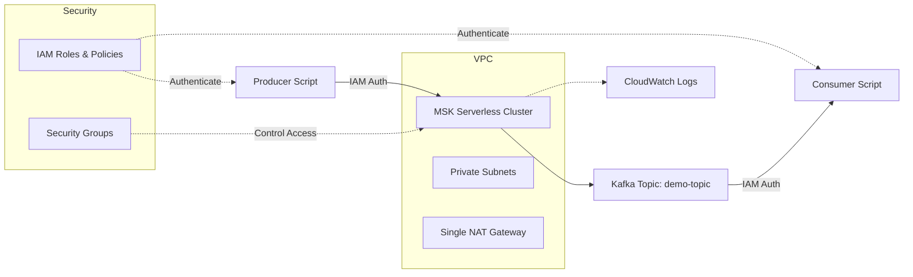

# AWS MSK Kafka Starter

[](https://github.com/saranreddy/aws-msk-kafka-starter/actions/workflows/ci.yml)
[](https://opensource.org/licenses/MIT)
[](https://www.terraform.io/)

A production-ready starter for AWS MSK (Managed Streaming for Apache Kafka) with Terraform infrastructure, Python producer/consumer scripts, and complete documentation. Deploy a fully functional Kafka cluster with IAM authentication in minutes.

## 👥 Who Is This For?

**This starter is built for:**
- Teams adopting Kafka on AWS without managing brokers or cluster capacity
- Platform engineers who need a known-good MSK Serverless + IAM auth baseline to build on
- Developers prototyping event streaming against real MSK infrastructure before committing to larger deployments
- Organizations evaluating managed Kafka offerings in their AWS environment

**Good fit when you need:**
- Event streaming between microservices or decoupled services with message replay
- Change data capture (CDC) pipelines or clickstream ingestion into data lakes
- Decoupling producers from multiple consumers with durable message retention
- A proof of concept before scaling to provisioned MSK or evaluating Confluent Cloud
- Common in e-commerce order processing, logistics event pipelines, fintech transaction streams, and adtech data platforms

**Not a good fit when:**
- You need simple point-to-point queuing or fan-out without replay — consider [AWS SQS, SNS, or EventBridge](https://docs.aws.amazon.com/eventbridge/) instead (see also: [`saranreddy/aws-eventbridge-lambda-sqs-starter`](https://github.com/saranreddy/aws-eventbridge-lambda-sqs-starter))
- Your workload requires sustained very high throughput (>200 MB/s writes) or broker-level tuning — provisioned MSK may be more cost-effective
- You're already standardized on Confluent Cloud or another managed Kafka service
- Budget is extremely constrained — MSK Serverless clusters cost ~$0.75/hour ($540+/month) plus NAT gateway costs (~$32/month), so **always `terraform destroy` after demos and testing**

## 🏗️ Architecture



**Key Components:**
- **MSK Serverless Cluster**: Fully managed Kafka with automatic scaling and no broker management
- **VPC with Private/Public Subnets**: Dedicated network with single NAT gateway for cost-effective demos
- **IAM Authentication**: Secure access using AWS IAM roles and policies
- **Python Scripts**: Simple producer and consumer CLIs for testing and demonstration
- **CloudWatch Integration**: Logs and monitoring for cluster health

**Cost-Optimized Defaults:**
- Single NAT gateway shared across all availability zones
- 2 AZs minimum (required by MSK) for ~$0.36 per 15-minute demo
- Can enable per-AZ NAT gateways for production high-availability

## ✨ Features

- ✅ **MSK Serverless** - No broker provisioning, pay only for what you use
- ✅ **Cost-Optimized Defaults** - ~$0.36 per 15-minute demo with single NAT gateway
- ✅ **Complete Terraform IaC** - Reproducible infrastructure with modular design
- ✅ **IAM Authentication** - Secure, credentials-free access using AWS IAM
- ✅ **Production-Ready Networking** - VPC, subnets, NAT gateway, security groups
- ✅ **Python Client Scripts** - Working producer/consumer examples with proper error handling
- ✅ **Health Checks & Smoke Tests** - Doctor script for diagnostics, smoke test for end-to-end validation
- ✅ **CI/CD Pipeline** - GitHub Actions for Terraform validation and Python linting
- ✅ **Comprehensive Documentation** - Clear setup instructions and troubleshooting guide

## 📋 Prerequisites

Before you begin, ensure you have:

- **AWS Account** with appropriate permissions (VPC, MSK, IAM, CloudWatch)
- **AWS CLI** ([installation guide](https://docs.aws.amazon.com/cli/latest/userguide/getting-started-install.html)) configured with credentials
- **Terraform** >= 1.5.0 ([download](https://www.terraform.io/downloads))
- **Python** >= 3.10 ([download](https://www.python.org/downloads/))
- **Git** for cloning this repository

Verify your setup:
```bash
aws --version
terraform --version
python --version
```

## 🚀 Quick Start

### Automated Setup (Recommended)

For a fully automated setup experience:

```bash
git clone https://github.com/saranreddy/aws-msk-kafka-starter.git
cd aws-msk-kafka-starter

# Run the setup script
./scripts/setup.sh
```

The setup script will:
- ✅ Check all prerequisites (AWS CLI, Terraform, Python)
- ✅ Verify AWS credentials
- ✅ Install Python dependencies
- ✅ Deploy infrastructure with Terraform
- ✅ Create the Kafka topic
- ✅ Export connection details to `.env.msk`

### Manual Setup

Prefer to run commands yourself? Follow these steps:

#### 1. Clone and Setup

```bash
git clone https://github.com/saranreddy/aws-msk-kafka-starter.git
cd aws-msk-kafka-starter

# Install Python dependencies
pip install -r requirements.txt
```

#### 2. Configure AWS Credentials

```bash
# Ensure AWS CLI is configured
aws configure list

# Verify you can access AWS
aws sts get-caller-identity
```

**💡 Run health checks (recommended):**

```bash
# Verify your AWS setup before deploying
python scripts/doctor.py
# OR
make doctor
```

The doctor script checks AWS credentials, Terraform installation, and configuration. See the [Health Checks & Testing](#-health-checks--testing) section for details.

#### 3. Deploy Infrastructure with Terraform

```bash
cd infra

# Initialize Terraform
terraform init

# (Optional) Use cost-optimized demo configuration
cp ../demo.tfvars terraform.tfvars
# OR customize your own:
# cp ../terraform.tfvars.example terraform.tfvars
# Edit terraform.tfvars to customize region, VPC CIDR, etc.

# Preview changes
terraform plan

# Deploy (takes ~5-10 minutes)
terraform apply
```

**⚠️ IMPORTANT: Region Consistency**
- Choose your AWS region in `terraform.tfvars` (default: `us-east-1`)
- Use the **same region** in all subsequent steps
- Verify with: `terraform output aws_region`

**✅ Verify deployment (recommended):**

After `terraform apply` completes, verify your setup:

```bash
# Run health checks
cd ..
python scripts/doctor.py

# Verify with smoke test (requires VPC network access)
# See Network Access section if not running from within VPC
make smoke
```

#### 4. Get Connection Details

```bash
# Export bootstrap servers for easy access
export BOOTSTRAP_SERVERS=$(terraform output -raw msk_bootstrap_brokers)
export KAFKA_TOPIC=$(terraform output -raw kafka_topic_name)
export AWS_REGION=$(terraform output -raw aws_region)

# Verify
echo "Bootstrap Servers: $BOOTSTRAP_SERVERS"
echo "Topic: $KAFKA_TOPIC"
echo "Region: $AWS_REGION"
```

#### 5. Create Kafka Topic

```bash
cd ../scripts

python create_topic.py \
  --bootstrap-servers "$BOOTSTRAP_SERVERS" \
  --topic "$KAFKA_TOPIC" \
  --partitions 2 \
  --replication-factor 2 \
  --region "$AWS_REGION"
```

#### 6. Produce Messages

```bash
python produce.py \
  --bootstrap-servers "$BOOTSTRAP_SERVERS" \
  --topic "$KAFKA_TOPIC" \
  --count 10 \
  --interval 1 \
  --region "$AWS_REGION"
```

Expected output:
```
2026-09-23 20:53:00,123 - __main__ - INFO - Starting Kafka producer...
2026-09-23 20:53:01,456 - __main__ - INFO - Successfully connected to MSK cluster
2026-09-23 20:53:02,789 - __main__ - INFO - Sent message 1/10 - Topic: demo-topic, Partition: 0, Offset: 0
...
```

#### 7. Consume Messages

In a separate terminal:

```bash
# Set environment variables (if not already set)
export BOOTSTRAP_SERVERS=$(cd infra && terraform output -raw msk_bootstrap_brokers)
export KAFKA_TOPIC=$(cd infra && terraform output -raw kafka_topic_name)
export AWS_REGION=$(cd infra && terraform output -raw aws_region)

cd scripts
python consume.py \
  --bootstrap-servers "$BOOTSTRAP_SERVERS" \
  --topic "$KAFKA_TOPIC" \
  --from-beginning \
  --region "$AWS_REGION"
```

Expected output:
```
2026-09-23 20:53:10,123 - __main__ - INFO - Starting Kafka consumer...
2026-09-23 20:53:11,456 - __main__ - INFO - Successfully connected to MSK cluster
2026-09-23 20:53:12,789 - __main__ - INFO - Received message 1 - Topic: demo-topic, Partition: 0, Offset: 0
2026-09-23 20:53:12,790 - __main__ - INFO - Message value: {
  "message_id": 1,
  "timestamp": "2026-09-23T20:53:02.789012",
  "data": "Hello from AWS MSK Kafka Starter - Message 1"
}
...
```

Press `Ctrl+C` to stop the consumer.

## 🩺 Health Checks & Testing

### Doctor Script

Before deploying infrastructure or troubleshooting issues, run the doctor script to verify your setup:

```bash
python scripts/doctor.py
# OR
make doctor
```

The doctor script performs comprehensive health checks:

✅ **Prerequisites**
- AWS CLI installation and version
- AWS credentials and authentication
- Terraform installation
- Python dependencies

✅ **Infrastructure**
- Terraform state and outputs
- Region consistency (environment, AWS CLI, Terraform)
- Bootstrap servers format validation

✅ **MSK Cluster**
- Cluster state (ACTIVE status)
- IAM permissions for MSK operations
- Network access requirements and VPC configuration

**Example output:**

```
================================================================================
AWS MSK Kafka Doctor - Health Check Results
================================================================================

✅ PASS - AWS CLI
    AWS CLI is installed: aws-cli/2.13.0

✅ PASS - AWS Credentials
    Authenticated as: arn:aws:iam::123456789012:user/admin

✅ PASS - Terraform
    Terraform is installed: v1.5.0

✅ PASS - Terraform State
    Terraform state found with 8 outputs

✅ PASS - Region Consistency
    All sources agree on region: us-east-1

✅ PASS - MSK Cluster Status
    MSK cluster is ACTIVE

================================================================================
Summary: 10/10 checks passed
================================================================================
```

**When to run the doctor:**
- ✅ Before deploying infrastructure (`terraform apply`)
- ✅ After deploying to verify setup
- ✅ When troubleshooting connectivity issues
- ✅ Before running producer/consumer scripts

### Smoke Test

After deploying infrastructure and verifying network connectivity, run the smoke test to validate end-to-end functionality:

```bash
# Set environment variables first
export BOOTSTRAP_SERVERS=$(cd infra && terraform output -raw msk_bootstrap_brokers)
export KAFKA_TOPIC=$(cd infra && terraform output -raw kafka_topic_name)
export AWS_REGION=$(cd infra && terraform output -raw aws_region)

# Run smoke test
python scripts/smoke_test.py \
  --bootstrap-servers "$BOOTSTRAP_SERVERS" \
  --topic "$KAFKA_TOPIC" \
  --region "$AWS_REGION"

# OR use Makefile
make smoke
```

**What the smoke test does:**

1. **Topic Creation** - Ensures the Kafka topic exists (creates if needed)
2. **Message Production** - Produces 5 test messages with unique IDs
3. **Message Consumption** - Consumes messages and verifies all were received
4. **Exit Code** - Returns 0 only if all steps succeed

**Example output:**

```
================================================================================
AWS MSK Kafka Smoke Test
Test ID: 20260923213045
Bootstrap: boot-xxxxx.yyyy.kafka-serverless.us-east-1.amazonaws.com:9098
Topic: demo-topic
Region: us-east-1
================================================================================

Step 1: Ensuring topic exists...
✅ Topic 'demo-topic' already exists

Step 2: Producing test messages...
  ✅ Sent message 1/5 (partition: 0, offset: 42)
  ✅ Sent message 2/5 (partition: 1, offset: 38)
  ✅ Sent message 3/5 (partition: 0, offset: 43)
  ✅ Sent message 4/5 (partition: 1, offset: 39)
  ✅ Sent message 5/5 (partition: 0, offset: 44)
✅ Successfully produced 5 messages

Step 3: Consuming and verifying messages...
  ✅ Received message 1/5 (partition: 0, offset: 42)
  ✅ Received message 2/5 (partition: 1, offset: 38)
  ✅ Received message 3/5 (partition: 0, offset: 43)
  ✅ Received message 4/5 (partition: 1, offset: 39)
  ✅ Received message 5/5 (partition: 0, offset: 44)
✅ All expected messages received

================================================================================
✅ SMOKE TEST PASSED
All messages were successfully produced and consumed
================================================================================
```

**Smoke test options:**

```bash
python scripts/smoke_test.py \
  --bootstrap-servers "$BOOTSTRAP_SERVERS" \
  --topic "demo-topic" \
  --region "us-east-1" \
  --message-count 10 \        # Number of test messages (default: 5)
  --timeout 60                 # Consumer timeout in seconds (default: 60)
```

**When to run the smoke test:**
- ✅ After deploying infrastructure (`terraform apply`)
- ✅ After making configuration changes
- ✅ To verify producer/consumer connectivity
- ✅ Before running your own applications

**Important notes:**
- ⚠️  Requires network connectivity to MSK brokers (see Network Access section below)
- ⚠️  Must be run from within the VPC or via SSM/bastion/VPN
- ⚠️  Returns exit code 0 on success, 1 on failure (suitable for CI/CD)

### Network Access for Testing

MSK Serverless uses **private VPC endpoints** (port 9098). To run smoke tests or producer/consumer scripts:

**Option 1: EC2 Instance in Same VPC** (Recommended for testing)
```bash
# Launch an EC2 instance in the same VPC
# Install dependencies
sudo yum install -y python3-pip git
git clone https://github.com/saranreddy/aws-msk-kafka-starter.git
cd aws-msk-kafka-starter
pip3 install -r requirements.txt

# Run smoke test
make smoke
```

**Option 2: AWS Systems Manager Session Manager**
```bash
# Port forward to MSK broker through SSM
aws ssm start-session \
  --target <instance-id> \
  --document-name AWS-StartPortForwardingSession \
  --parameters '{"portNumber":["9098"],"localPortNumber":["9098"]}'
```

**Option 3: VPN or AWS Direct Connect**
- Connect your local network to the VPC
- Requires VPN or Direct Connect setup

**Option 4: Bastion Host**
- Deploy a bastion host in a public subnet
- SSH tunnel through the bastion to access MSK

**Local Testing Limitation:**
- ❌ Cannot connect directly from laptop/desktop without VPC network path
- ✅ Doctor script can verify AWS credentials and Terraform state locally
- ✅ Smoke test requires VPC connectivity

## 💰 Cost Estimate

### Understanding Your Costs

**⏱️ Short Demo Cost (15-20 minutes):**
- MSK Serverless cluster: ~$0.25
- NAT Gateway: ~$0.10
- Data transfer & storage: ~$0.01
- **Total demo cost: ~$0.36** (less than 40 cents!)

**📅 If Left Running Monthly:**
- MSK Serverless cluster: ~$540/month ($0.75/hour × 730 hours)
- Single NAT Gateway: ~$32/month ($0.045/hour × 730 hours)
- 2 partitions: ~$2.16/month
- Storage (< 1 GB): ~$0.10/month
- **Total if left running: ~$574/month**

### MSK Serverless Pricing Breakdown

MSK Serverless charges for:
1. **Cluster usage** - $0.75/hour per cluster
2. **Partition usage** - $0.0015/hour per partition
3. **Storage** - $0.10/GB-month
4. **Data transfer** - Standard AWS rates

### NAT Gateway Pricing

- **Single NAT Gateway** (default): ~$32/month ($0.045/hour)
- **Per-AZ NAT Gateways** (high-availability): ~$64/month for 2 AZs

This starter uses **one NAT gateway by default** to minimize demo costs while maintaining full functionality.

### 💡 Cost Optimization Guide

**For Quick Demos (<1 hour):**
- ✅ Use the default single NAT gateway configuration
- ✅ Destroy immediately after testing (`terraform destroy`)
- Cost: **Less than $1**

**For Development (few hours/day):**
- ✅ Keep single NAT gateway
- ✅ Use `terraform destroy` when done for the day
- Daily cost: ~$2-5 depending on usage

**For High-Availability Production:**
- Set `single_nat_gateway = false` in `terraform.tfvars`
- Each AZ gets its own NAT gateway for fault tolerance
- Costs increase but eliminate single point of failure

### ⚠️ IMPORTANT: This is NOT a free-tier project
Running this infrastructure will incur charges. **Always destroy resources when finished** with testing to avoid ongoing costs.

### 🔥 Quick Teardown
```bash
cd infra && terraform destroy
```
Type `yes` when prompted. This typically completes in 2-3 minutes.

## 🧹 Teardown

When you're done, destroy all resources to stop incurring charges:

```bash
cd infra
terraform destroy
```

Type `yes` when prompted.

**Manual cleanup (if needed):**

Sometimes ENIs (Elastic Network Interfaces) created by MSK don't get deleted immediately:

```bash
# List remaining ENIs
aws ec2 describe-network-interfaces \
  --filters "Name=description,Values=*msk*" \
  --query 'NetworkInterfaces[*].[NetworkInterfaceId,Description,Status]' \
  --output table

# If ENIs are stuck, wait 5-10 minutes and run terraform destroy again
```

**Verify cleanup:**
```bash
# Check for any remaining MSK clusters
aws kafka list-clusters-v2 --region "$AWS_REGION"

# Check for VPC
aws ec2 describe-vpcs --filters "Name=tag:Project,Values=msk-kafka-starter" --region "$AWS_REGION"
```

## 🔧 Configuration

### Terraform Variables

Customize your deployment by creating `infra/terraform.tfvars`:

```hcl
aws_region  = "us-west-2"
environment = "production"
project_name = "my-kafka-cluster"

# VPC Configuration
vpc_cidr           = "10.1.0.0/16"
availability_zones = ["us-west-2a", "us-west-2b", "us-west-2c"]

# NAT Gateway: single (cost-optimized) vs per-AZ (high-availability)
single_nat_gateway = false  # Use per-AZ NAT gateways for production
```

**Pre-configured Options:**
- `demo.tfvars` - Cost-optimized for short demos (~$0.36 per 15 min)
- `terraform.tfvars.example` - Template with all available options

See `terraform.tfvars.example` for all available options.

### Key Configuration Options

| Variable | Default | Description | Cost Impact |
|----------|---------|-------------|-------------|
| `single_nat_gateway` | `true` | Use one NAT gateway for all AZs | Saves ~$32/month per additional NAT gateway |
| `availability_zones` | 2 AZs | Number of AZs (min 2 for MSK) | More AZs = higher network costs |
| `kafka_topic_partitions` | 2 | Number of topic partitions | ~$1.08/month per partition |

### Python Scripts Configuration

Alternatively, use a config file for Python scripts:

```bash
cp config.example.yaml config.yaml
# Edit config.yaml with your values from terraform outputs
```

Then run scripts without command-line arguments:
```python
# Add config file support to scripts
import yaml
with open('config.yaml') as f:
    config = yaml.safe_load(f)
```

## 🧪 Testing

### Run All Checks Locally

```bash
# Terraform formatting and validation
cd infra
terraform fmt -check
terraform validate

# Python formatting and linting
cd ../
pip install black isort pylint
black --check scripts/
isort --check-only scripts/
pylint scripts/*.py
```

### CI/CD

GitHub Actions automatically runs these checks on every push and pull request. See `.github/workflows/ci.yml`.

## 🐛 Troubleshooting

### Common Issues

#### 1. Authentication Errors

**Error:** `Not authorized to perform: kafka-cluster:Connect`

**Solution:**
- Ensure your AWS credentials are properly configured
- Verify the IAM role has the required MSK permissions
- Check that you're using the correct AWS region

```bash
# Assume the MSK client role
aws sts assume-role \
  --role-arn $(cd infra && terraform output -raw msk_client_role_arn) \
  --role-session-name msk-test
```

#### 2. Connection Timeouts

**Error:** `kafka.errors.NoBrokersAvailable: NoBrokersAvailable`

**Solution:**
- Verify security group rules allow traffic on port 9098
- Check that bootstrap servers are correct: `terraform output msk_bootstrap_brokers`
- Ensure MSK cluster is in `ACTIVE` state:
  ```bash
  aws kafka describe-cluster-v2 \
    --cluster-arn $(cd infra && terraform output -raw msk_cluster_arn)
  ```

#### 3. Region Mismatch

**Error:** `Could not connect to any broker`

**Solution:**
- Ensure all commands use the same AWS region
- Verify: `echo $AWS_REGION`
- Bootstrap servers contain the region in their hostname

#### 4. Topic Already Exists

**Error:** `TopicAlreadyExistsError`

**Solution:**
- This is expected if running `create_topic.py` multiple times
- To list existing topics:
  ```bash
  python create_topic.py --bootstrap-servers "$BOOTSTRAP_SERVERS" --list-only --region "$AWS_REGION"
  ```

#### 5. Terraform Destroy Hangs

**Issue:** `terraform destroy` hangs on ENI deletion

**Solution:**
- Wait 5-10 minutes for MSK to fully release ENIs
- Run `terraform destroy` again
- Manually delete stuck ENIs in AWS Console if needed

### Debug Commands

```bash
# Check MSK cluster status
aws kafka describe-cluster-v2 \
  --cluster-arn $(cd infra && terraform output -raw msk_cluster_arn) \
  --query 'ClusterInfo.State'

# View CloudWatch logs
aws logs tail /aws/msk/msk-kafka-starter-dev --follow

# Test AWS credentials
aws sts get-caller-identity

# Verify network connectivity from an EC2 instance
telnet <bootstrap-server-endpoint> 9098
```

## 📚 Additional Resources

- [AWS MSK Developer Guide](https://docs.aws.amazon.com/msk/latest/developerguide/what-is-msk.html)
- [MSK Serverless Documentation](https://docs.aws.amazon.com/msk/latest/developerguide/serverless.html)
- [Kafka Python Client Documentation](https://kafka-python.readthedocs.io/)
- [Terraform AWS Provider](https://registry.terraform.io/providers/hashicorp/aws/latest/docs)

## 🤝 Contributing

Contributions are welcome! Please feel free to submit a Pull Request.

1. Fork the repository
2. Create your feature branch (`git checkout -b feature/amazing-feature`)
3. Commit your changes (`git commit -m 'Add amazing feature'`)
4. Push to the branch (`git push origin feature/amazing-feature`)
5. Open a Pull Request

## 📄 License

This project is licensed under the MIT License - see the [LICENSE](LICENSE) file for details.

## 🙏 Acknowledgments

- Inspired by production Kafka deployments
- Built with best practices from AWS Well-Architected Framework
- Community feedback and contributions

## ⚠️ Disclaimer

This is a starter template optimized for development, testing, and demos. 

**Cost Management:**
- Default configuration: ~$0.36 for a 15-minute demo
- If left running: ~$574/month
- **Always run `terraform destroy` when finished**

**For production use:**
- Set `single_nat_gateway = false` for high availability
- Review and adjust security group rules
- Implement proper monitoring and alerting
- Consider multi-region setup for high availability
- Enable encryption at rest and in transit
- Implement proper backup and disaster recovery
- Review IAM policies for least privilege access

---

**Made with ❤️ by [Saran Reddy](https://github.com/saranreddy)**

If you find this helpful, please ⭐ star the repository!
